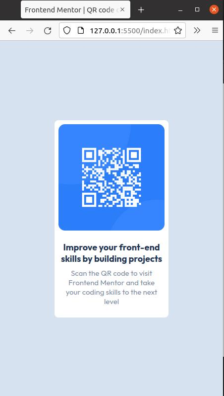
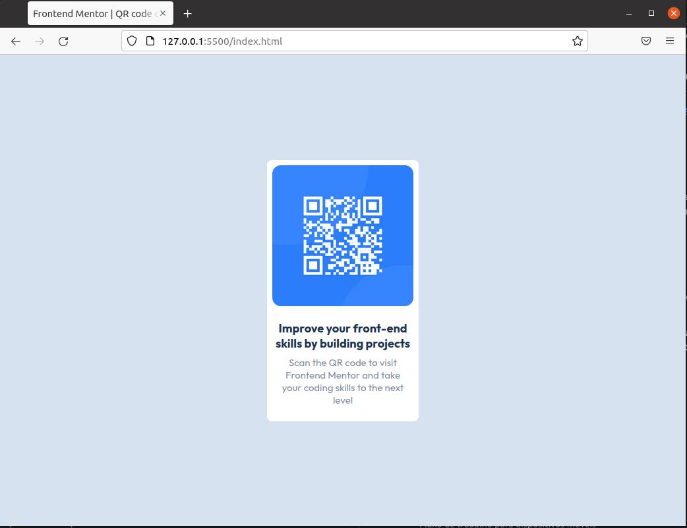

# Frontend Mentor - solução de componente de código QR 

Esta é uma solução para o [desafio do componente de código QR no Frontend Mentor](https://www.frontendmentor.io/challenges/qr-code-component-iux_sIO_H). Os desafios do Frontend Mentor ajudam você a melhorar suas habilidades de codificação criando projetos realistas. 

 

<h1 align="center"> Componente qr-code </h1>

 <a href="# Sobre">Sobre</a>
 |
 <a href="#Conteúdo">Projeto realizado</a>
 |
 <a href="#Tecnologias estudadas">Tecnologias</a>
 |
 <a href="# Como abrir o projeto">Instalação e testes</a>
 |
 <a href="# Projetos semelhantes">Autor</a>

## Visão geral 

### Captura de tela 
 
1. Versão mobile

<h1 align="center">
    
</h1>

2. Versão desktop

<h1 align="center">
    
</h1>

Como alternativa, você pode usar uma ferramenta como [FireShot](https://getfireshot.com/) para fazer a captura de tela. FireShot tem uma opção gratuita, então você não precisa comprá-la. 

Em seguida, corte/otimize/edite sua imagem como quiser, adicione-a ao seu projeto e atualize o caminho do arquivo na imagem acima.

**Nota: Exclua esta nota e os parágrafos acima ao adicionar sua captura de tela. Se preferir não adicionar uma captura de tela, sinta-se à vontade para remover esta seção inteira.** 

### Links 

- URL da solução: [https://github.com/yuryshadow/qr-code-component-main.git]
- URL do site ativo : [https://yuryshadow.github.io/qr-code-component-main/]

## Meu processo 

### Construído com 

- Marcação HTML5 semântica 
- Propriedades personalizadas de CSS 
- Flexbox 
- Fluxo de trabalho para dispositivos móveis 

 

### O que aprendi 

Neste projeto pratiquei a utilização de flex box para ciar um card de qrcode, onde pude centralizar o mesmo no meio, e oloar em prática todo conteúdo teórico estudado nos meus estudos pessoais.

Para ver como você pode adicionar trechos de código, veja abaixo: 

 

# Tecnologia utilizada
Para a realização desse projeto utilizei as tecnologias:

 
  
  

  

# Projetos semelhantes

<a href="https://github.com/yuryshadow/campo-minado-java"> 1. Jogo campo minado </a>
 

# 
Made with 🖥️ by YURI CARLOS ✌️ <a href="https://www.linkedin.com/in/yurisouza/">See my LinkedIn </a>
